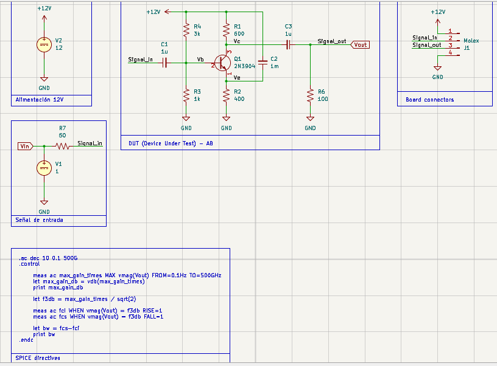
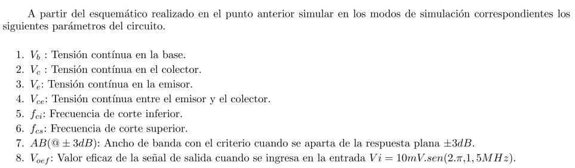
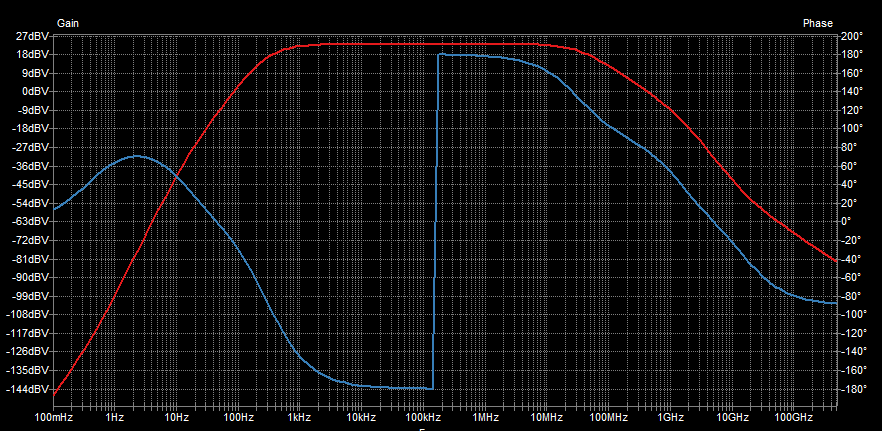
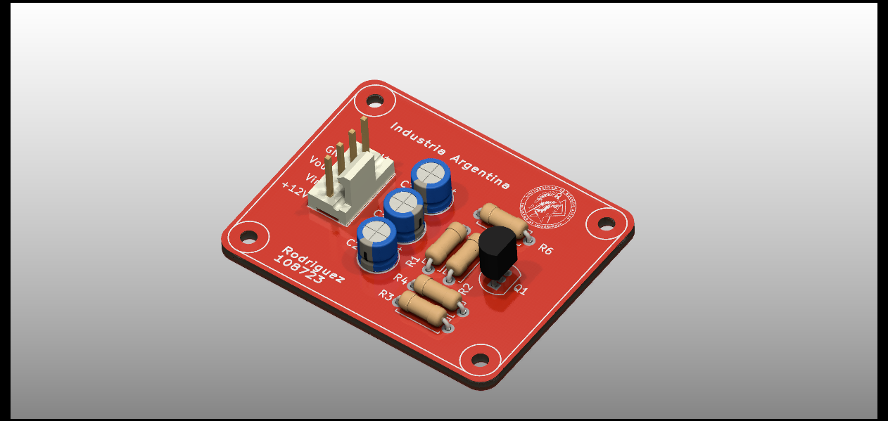
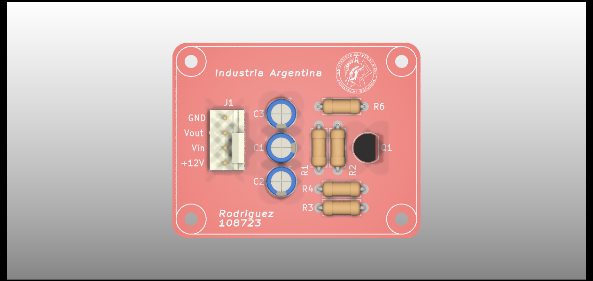
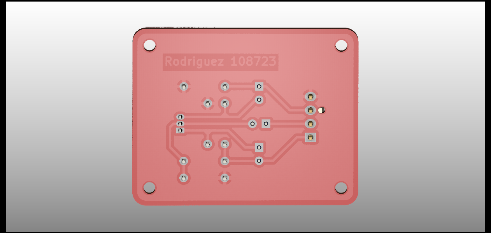

# Respuestas teóricas
A continuaicón se presentan las respuestas a las preguntas teóricas del parcial desarrollado el dia 28/11/23.

## Realización
Inicialmente se realiza el esquematico quedando de la siguiente forma



En este se pueden ver los modulos que lo componen. A su vez desarrolle un breve script que me permite calcular el ancho de banda, la ganancia en dBV y veces, la frecuencia de corte inferior y superior.
Esto me será útil para la segunda instancia de la practica.

## Simulación


- Vb: Tensión de base (**2.97029 V**)
- Vc: Tensión de colector (**8.61053 V**)
- Ve: Tensión de emisor (**2.27549 V**)
- Vce: Tensión colector emisor (**6.33504 V**)

### Simulación de respuesta en frecuencia

Se realizó la simulación de respuesta en frecuencia, obteniendo los siguientes resultados en el diagrama de bode y con el script desarrollado.

```ltspice
.ac dec 10 0.1 500G
.control

	meas ac max_gain_times MAX vmag(Vout) FROM=0.1Hz TO=500GHz
	let max_gain_db = vdb(max_gain_times)
	print max_gain_db

	let f3db = max_gain_times / sqrt(2)

	meas ac fci WHEN vmag(Vout) = f3db RISE=1
	meas ac fcs WHEN vmag(Vout) = f3db FALL=1

	let bw = fcs-fci
	print bw
.endc
```
Explicare brevemente el script:
- Se realiza un barrido de frecuencia de 0.1Hz a 500GHz con 10 puntos por decada.
- Se utiliza la funcion **meas** para medir la magnitud de la salida (**Vout**) y se almacena en la variable **max_gain_times** el valor máximo (**MAX**) de la magnitud de la salida.
- Se calcula la ganancia en dBV (**vdb()**) a partir de la magnitud de la salida máxima y se almacena en la variable **max_gain_db**.
- Se define la caida de la ganancia en +-3dB (**f3db**) como la frecuencia de la salida máxima dividida la raiz de 2 pues es el 70.7% de la salida máxima.
- Barriendo de izquierd a derecha, se utiliza la función **meas** para medir la frecuencia de corte inferior (**fci**) cuando la magnitud de la salida se encuentra en ascenso (**RISE**) y se almacena en la variable **fci**. Analogamente se realiza para la frecuencia de corte superior (**fcs**) cuando la magnitud de la salida se encuentra en descenso (**FALL**). Este procedimiento coloquialmente se puede decir que es como 'colocar un trigger a la altura de -3dB y que se dispare cuando la señal lo atraviese tanto por flanco ascendente como descendente'.
- Se calcula el ancho de banda (**bw**) como la diferencia entre la frecuencia de corte superior e inferior.
- Se imprime por pantalla la ganancia en dBV y el ancho de banda.

### Resultados de simulación



- fci: frecuencia de corte inferior (**491.9895 Hz**)
- fcs: frecuencia de corte superior (**32.281320 MHz**)
- AB(@+-3dB): Ancho de banda a +-3dB (**32.28082801 MHz**)
- Av: Ganancia en veces (**13.99258**)
- Av_db: Ganancia en dBV (**22.91796 dBV**)
- Vo_RMS: Tensión RMS de salida cuando se aplica una señal de 10mVp a 1.5MHz calculado (**0.0989 V**) >> Simulado aproximadamente (**0.10289 V**)


## Realización de PCB
Al momento de realizar el PCB se tuvieron en cuenta las siguientes consideraciones:
- Por no disponer de medidas de los componentes se escogió de forma arbitraria el tamaño de los capacitores y resistencias.
- Se utilizó un encapsulado TO-92 para el transistor.
- Se utlizaron resistencias de 1/4W.
- Se agrega a la serigrafía el logo de la institución.
- Se agrega en el cobre el apellido del alumno.
- Se utiliza un conector molex (tipo ventilador de PC) para la alimentación y entrada de señal pues de esta forma se previene la inversión de polaridad.

El resultado final es el siguiente:



Vista superior



Vista inferior



